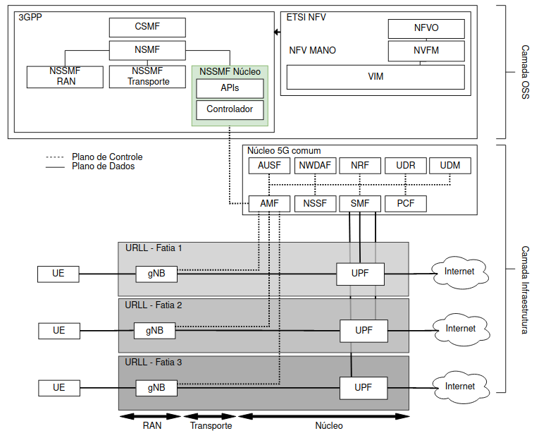
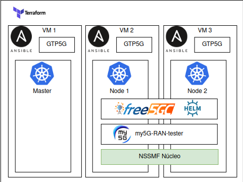

# 5G Core Auto Scale Network Slicing

 This project focus on observability to visualize core communication and implement Network Slicing in the future

Technological advances in the fifth-generation (5G) mobile networks are based on native cloud computing platforms and Kubernetes has emerged as the orchestration  ystem for virtualized infrastructure. However, these platforms were not designed to natively support 5G services. To illustrate, Kubernetes is designed to be agnostic to the services which orchestrates and is not able to dynamically reconfigure the 5G core according to existing network resources, i.e., it provides a partial dynamic orchestration to perform network slicing. This paper proposes is an easy to use infrastructure and monitoring implementation of the [free5GC](www.free5gc.org)+[open-free5gc-helm](https://github.com/fhgrings/open-free5gc-helm) project. Running on AWS or Proxmox environment using Terraform and Ansible as IaC.a solution integrated with Kubernetes to allow full dynamic  orchestration of network slicing at runtime, with neededs adjust in the 5G core. This integration is accomplished through a Kubernetes-integrated controller and   proxy for control plane. The controller adjusts the 5G core and adapts the virtualized infrastructure, while the proxy creates an abstraction for the  ontrol communication between access and transport networks with the core. The experimental results showed a reconfiguration based on total dynamic orchestration without interruption of the services provided, reducing the total reconfiguration requests number by network slices by 47.5%.


## Requirements

AWS Account **or** ProxMox Hypervisor

For one-step deploy Linux is required Or

Terraform;

Ansible.


## Architecture

High Level architecture is based in Proxmox Hypervisor (AWS compatible) using 3 virtual machines, 2 Kuberentes Worker and 1 Kubernetes Master. The projetct uses observability principles described on "Production-Ready Microsservices", by  O"Reilly. The project load metrics from hosts using Prometheus and send to grafana. The applications send tracing logs, and metrics via PinPoint Goland Agent to PinPoint APM. Jaeger was tested but the technology is not matture to easy-to-use on this project.


The AWS architecture was designed to provide the entire AWS VPC and security resources. Terraform with AWS provider build the entire infrastructure that corresponds to:

* 1x Global VPC - Cloud network and security configurations;
* 2x Subnets (Public and Private) - Separate Master and Nodes Public access;
* 2x Routers (Public and Private) - Co ingress and outgress trafic;
* 1x Gateway to expose public Router to internet;
* 1x NAT to private Subnet;
* 2x Security Groups with same configuration to implements in the future port restrictions.


Kubernetes cluster is configured by Ansible Playbook. Follow free5GC Helm especifications.

* GTP5G Kernel Module - For UPF tunneling communication;
* Helm 3+ - For Free5GC Cluster Deploy;
* Simple CNI (Flannel) - Main Cluster CNI;
* Multus CNI - For UPF seccundary interface configuration;
* Free5GC Namespace;
* free5gc-local-pv - For Mongo Volume;
* MongoDB.

After configuring Free5GC Helm especifications the playbook add Prometheus, Nginx Ingress Controller, Fluend and run Helm Install.




### Prototype


## Installation and Getting Started

To run you need to follow 3 steps
* Terraform
* Build k8s Cluster
* Deploy 5g Core environment

In Terraform stage you can choose between AWS or Proxmox, so:

If you already have VMs ingore the first step.


### Build AWS Infrastructure

Create AWS account

Define AWS Credentials (Access Keys)

```bash
cd terraform-prov-aws
./run.sh (Create Buckets for terraform Backend)
terraform init
terraform plan
terraform apply --auto-approve
```

### Build Local VMs Infrastructure


### Build Kubernetes Environment

#### If AWS
To run AWS configuration remember to add [AWS Credentials](https://docs.aws.amazon.com/sdk-for-javascript/v2/developer-guide/getting-your-credentials.html)

To install run the commands:

```bash
cd ansible-k8s
./run.sh
```

After Installed enter on [AWS Console](https://us-east-2.console.aws.amazon.com/console/home) and connect to K8S-DEMO-EC2-MASTER-pub;


#### If Local VMs
```bash
cd  ansible-k8s
# Update hosts file with IP/Domain name from your master and workers
./run-local.sh
```

Run the commands:

```bash
export KUBECONFIG=/etc/kubernetes/adming.config
kubectl get pods -A
```

### Insall Free5gc Core
```bash
cd ./ansible-free5gc
# Update hosts file with IP/Domain name from your master and workers
./run-local.sh
```


### Check Availability
```bash
export KUBECONFIG=/etc/kubernetes/adming.config
kubectl get pods -A
```
Check if all pods are running 


#### FAQ
Problem

Mongodb pending with message "1 node(s) had volume node affinity conflict"

Solution

Persistent volume with wrong domain refering. Recreate the PV with right destin values (Update on ./ansible-free5gc/k8s-master/tasks/main.yml @task-name[create free5gc pvc] values)

### Monitoring

For a better cluster overview I recommend to install Lens IDE and connect to Kubernetes Cluster:


- [x] **PinPoint**
- [x] **Elastic APM**
- [x] ~~NewRelic~~ (Not Working - Go Agent needs Go 1.17+)
- [x] ~~OpenTelemtry~~ (No Agent for gin/gonic)
- [x] ~~Datadog~~ (No Agent for gin/gonic)


It was possible to group all the requests made in the applications, but without tracking the senders, only the receivers.


Refs:

https://opentelemetry.io/docs/instrumentation/go/getting-started/

https://github.com/pinpoint-apm/pinpoint-go-agent/tree/main/plugin/gin

https://pkg.go.dev/net/http

https://pkg.go.dev/golang.org/x/net/http2/h2c

https://github.com/free5gc/amf/blob/e857bcd091ec69e66a2d390345fb4faf5c5d89e2/consumer/nf_mangement.go (Exemplo de classe: Nnrf_NFManagement)


## Refs

https://github.com/pinpoint-apm/pinpoint-go-agent/tree/main/plugin/gin

https://pkg.go.dev/net/http

https://pkg.go.dev/golang.org/x/net/http2/h2c

https://docs.aws.amazon.com/

https://www.free5gc.org/

https://github.com/ciromacedo/5GCore-easy-install

https://github.com/Orange-OpenSource/towards5gs-helm
